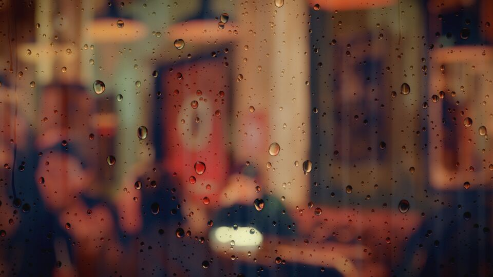
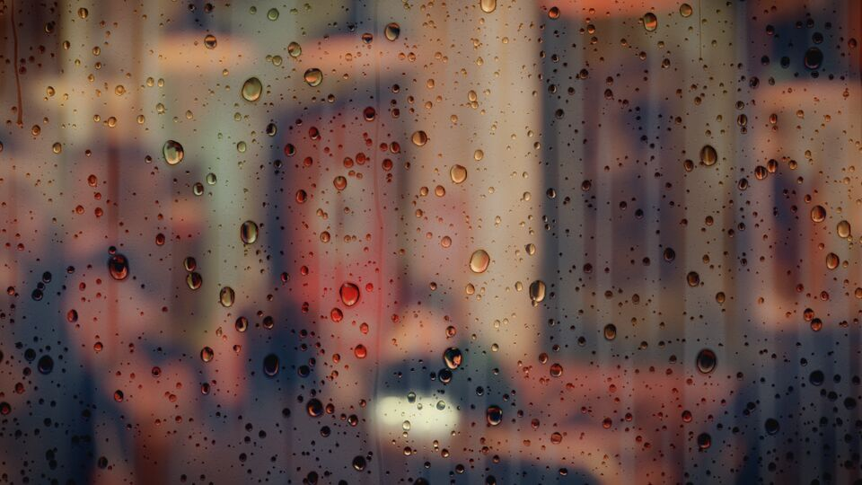
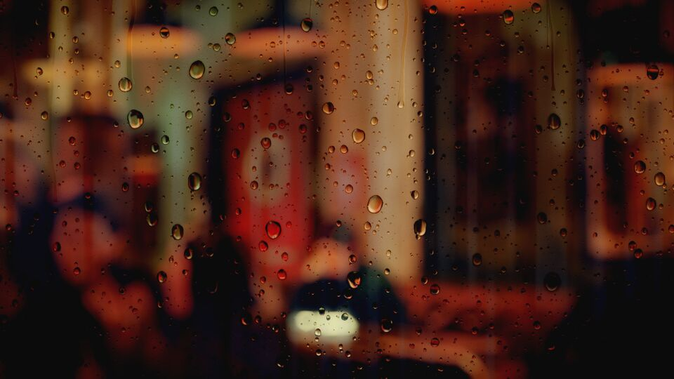
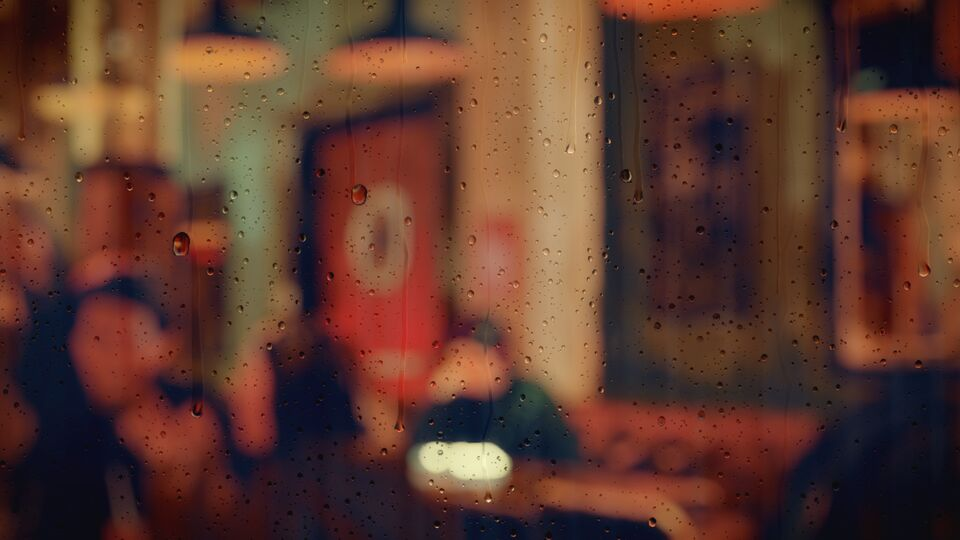
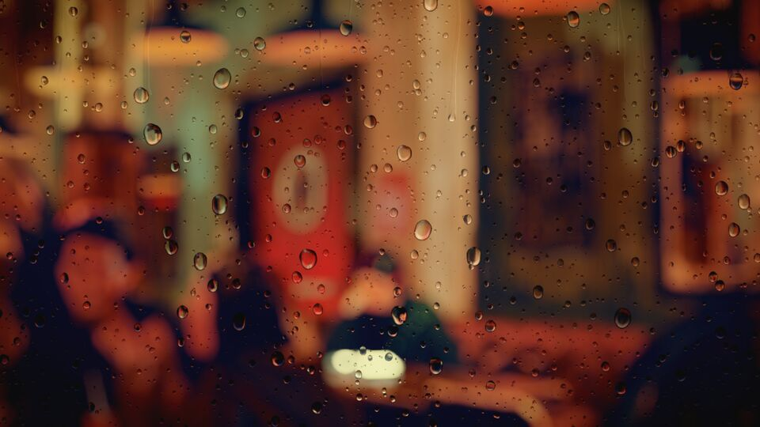
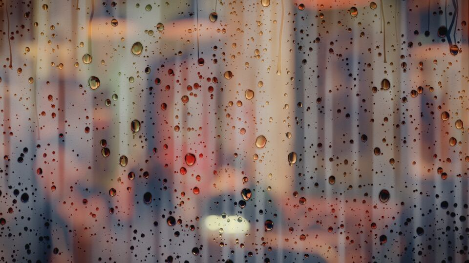
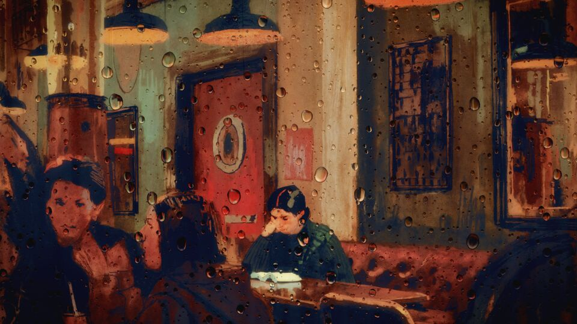
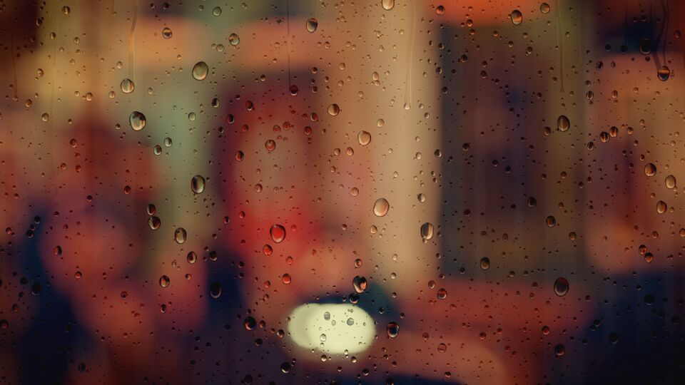
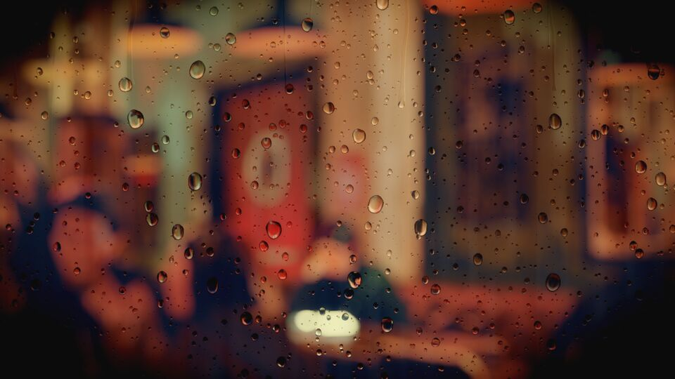
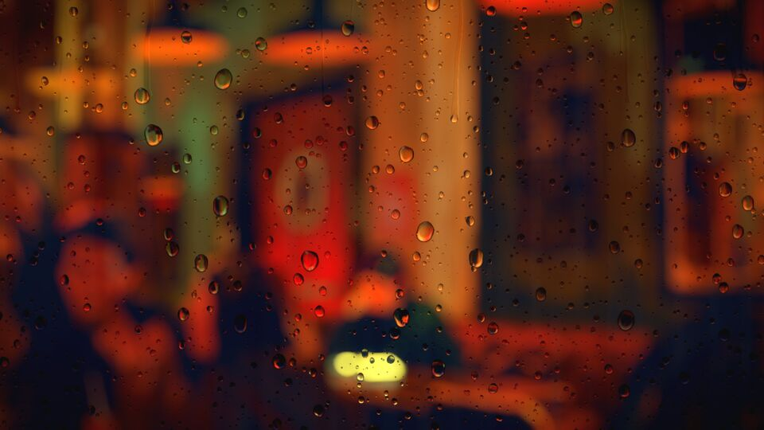

# Settings gallery

Every image is the same wallpaper and the same moment (t = 20s), rendered at 1080p with only the listed keys changed from the defaults. See the README for the full settings table.

## Preset `default`

`{}`

## Preset `drizzle`: few runners, fewer drops, light fog

`{"rain":{"amount":0.25,"spawnRate":0.5},"drops":{"density":0.7},"fog":{"amount":0.35}}`

## Preset `downpour`: runners everywhere, fast, three size classes

`{"rain":{"amount":0.95,"spawnRate":2.2,"speed":1.4,"layers":3},"drops":{"density":1.3,"spawnRate":2.5},"fog":{"amount":0.5}}`

## Preset `foggy`: heavy condensation, slow re-fogging

`{"rain":{"amount":0.35},"fog":{"amount":0.9,"grain":0.9,"regrow":0.25}}`

## Preset `dry`: no runners, sparse drops, almost no fog

`{"rain":{"amount":0.0},"drops":{"density":0.8,"spawnRate":0.2},"fog":{"amount":0.2}}`

## Preset `night`: strong bokeh discs with 7 blades, cool fog

`{"blur":{"highlightBoost":3.0,"ring":0.8,"blades":7},"fog":{"amount":0.5,"tint":[0.7,0.8,1.0]},"post":{"brightness":0.9}}`

## `rain.amount` 0.1

`{"rain":{"amount":0.1}}`

## `rain.amount` 1.0

`{"rain":{"amount":1.0}}`

## `rain.size` 0.6

`{"rain":{"size":0.6}}`

## `rain.size` 1.8

`{"rain":{"size":1.8}}`

## `rain.trailWidth` 0.5

`{"rain":{"trailWidth":0.5}}`

## `rain.trailWidth` 2.0

`{"rain":{"trailWidth":2.0}}`

## `rain.wander` 0

`{"rain":{"wander":0}}`

## `rain.wander` 3

`{"rain":{"wander":3}}`

## `drops.density` 0.4

`{"drops":{"density":0.4}}`

## `drops.density` 2.2

`{"drops":{"density":2.2}}`

## `drops.size` 0.6

`{"drops":{"size":0.6}}`

## `drops.size` 1.6

`{"drops":{"size":1.6}}`

## `drops.irregularity` 0: perfect ovals

`{"drops":{"irregularity":0}}`

## `drops.irregularity` 2

`{"drops":{"irregularity":2}}`

## `fog.amount` 0

`{"fog":{"amount":0}}`

## `fog.amount` 0.8

`{"fog":{"amount":0.8}}`

## `fog.lift` 0.8: milky condensation

`{"fog":{"amount":0.6,"lift":0.8}}`

## `fog.grain` 0

`{"fog":{"amount":0.6,"grain":0}}`

## `optics.lensZoom` 1: barely refracting

`{"optics":{"lensZoom":1,"field":0}}`

## `optics.lensZoom` 14: wide inverted field

`{"optics":{"lensZoom":14}}`

## `optics.sharpness` 0: drops show the blurred scene

`{"optics":{"sharpness":0}}`

## `optics.sharpness` 1

`{"optics":{"sharpness":1}}`

## `optics.rimDark` 0 and `optics.outline` 0

`{"optics":{"rimDark":0,"outline":0}}`

## `optics.rimDark` 1 and `optics.outline` 1

`{"optics":{"rimDark":1,"outline":1}}`

## `optics.highlight` 0

`{"optics":{"highlight":0}}`

## `optics.highlight` 2.5

`{"optics":{"highlight":2.5}}`

## `blur.radius` 0: sharp wallpaper

`{"blur":{"radius":0}}`

## `blur.radius` 60

`{"blur":{"radius":60}}`

## `blur.blades` 6 with `blur.highlightBoost` 10

`{"blur":{"blades":6,"highlightBoost":10,"threshold":0.4}}`

## `glass.vignette` 0.9

`{"glass":{"vignette":0.9}}`

## `post.filmic` 0, `post.saturation` 1.2

`{"post":{"filmic":0,"saturation":1.2}}`

## `post.saturation` 0.15

`{"post":{"saturation":0.15}}`

